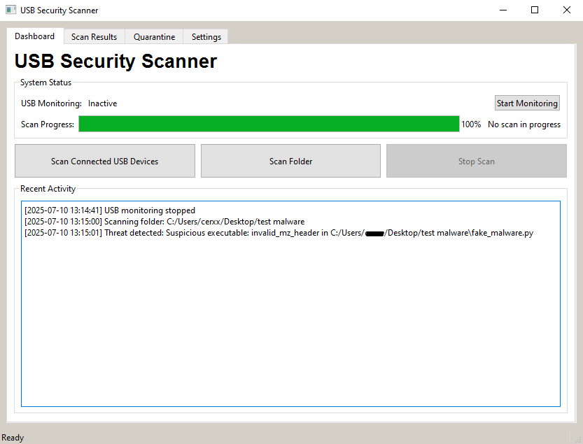
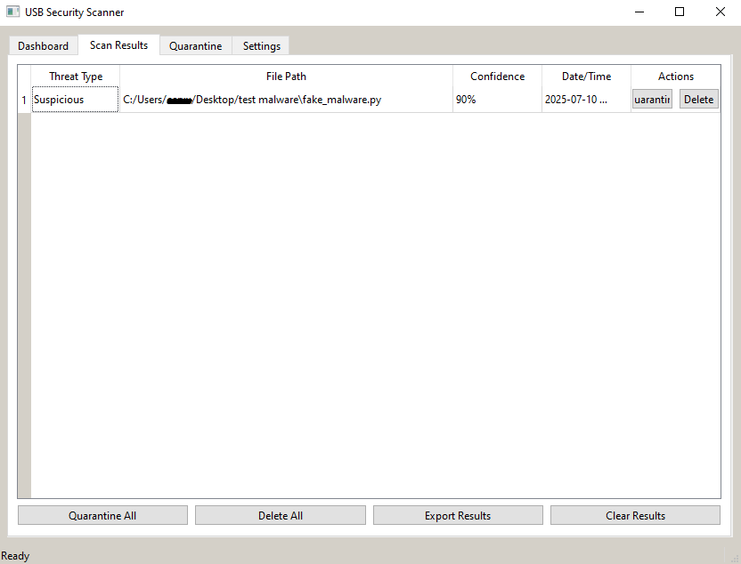

# ThreatScanUSB

ThreatScanUSB watches over your USB drives the moment they’re plugged in, giving you peace of mind by catching malware, suspicious executables, and sneaky autorun files before they can cause trouble.




---

## What Makes It Good In My Opinion

* **Multiple Detection Methods**

  * Advanced heuristic analysis
  * File entropy measurement
  * Pattern recognition for known bad behaviors
  * Executable behavior analysis
  * File header & structure inspection
  * YARA-based malware signature matching
  * Hidden file & extension mismatch checks
  * Optional VirusTotal API integration
  * Optional ClamAV integration

* **Easy Threat Management**
  Quarantine or remove risks with a single click, or bulk-process all threats at once.

* **Clean, Intuitive Dashboard**
  User friendly GUI

* **Light on Resources**
  Designed to run smoothly, using minimal CPU and memory.

---

## Getting Started

**Requirements:**

* Windows 10 or newer
* Python 3.8+
* Admin rights (needed for low-level scan operations)

**Install:**

1. Clone or download this repo:

   ```bash
   git clone https://github.com/dobusnt/ThreatScanUSB.git
   cd ThreatScanUSB
   ```
2. Install dependencies:

   ```bash
   pip install -r requirements.txt
   ```


---

## Running from a USB Drive

1. Copy the entire `ThreatScanUSB` folder onto your USB stick.
2. Plug it into any computer and browse to the folder.
3. Launch the app:

   * **Windows:** double‑click `RunFromUSB.bat`


Settings and logs will live on the USB (unless write-protected, then they’ll default to your AppData folder).

---

## How to Use

### 1. Scan a USB Drive

1. Plug in the USB you want to check.
2. Hit **"Scan Connected USB Devices"**.
3. If more than one drive is detected, pick which one to scan.
4. Watch the results roll in under **Scan Results**.

### 2. Scan Any Folder

1. Click **"Scan Folder"**.
2. Pick your folder.
3. Results appear in **Scan Results**—same as USB scans.

### 3. Managing Threats

* **Quarantine:** Isolate a suspect file for later review.
* **Delete:** Permanently remove threats.
* Bulk actions let you quarantine or delete all at once.
* **Export:** Download scan details as a CSV for reports.

### 4. Quarantine Management

* See every quarantined file, its original path, and threat type.
* Restore any file you believe was flagged by mistake.
* Permanently delete files you’re sure are dangerous.

---

## Testing the Scanner

1. Head to `ThreatScanUsb/tests`—harmless files crafted to look suspicious.
2. Run:

   ```bash
   python tools/test_detection.py
   ```
3. Check which patterns got flagged.
4. Feel free to add your own test files to that folder!

---

## Configuration Options

* **Auto-Scan on USB Insert**
* **Max File Size to Scan**
* **Hidden Directory Scanning** (on/off)
* **YARA Rules** (enable/disable)
* **ClamAV Integration** settings
* **VirusTotal API Key** setup
* **Theme**: light, dark, or system default (dark themes are bugged)
* **Notifications** preferences

---

## Custom Detection Rules

1. Drop your `.yar` or `.yara` files into `resources/yara_rules`.
2. Edit `src/scanner.py` to tweak pattern lists or add new ones.
3. Adjust sensitivity thresholds in the settings to fine‑tune detection.

---

## Development

**Project Layout:**

```
src/           # Core code
  main.py      # Entry point
  usb_monitor.py
  scanner.py
  gui.py       # PyQt interface
  config.py
resources/     # Assets & rules
  yara_rules/
  screenshots/
  icons/
tests/        
docs/         # Extra documentation (there arent any)
```

**Contribute:**

1. Fork the repo
2. `git checkout -b feature/YourFeature`
3. `git commit -m "Add YourFeature"`
4. `git push origin feature/YourFeature`
5. Open a PR and I’ll review it!

---

## License

This project is released under the MIT License. See [LICENSE](LICENSE) for details.

---

## Acknowledgments

* **[YARA](https://virustotal.github.io/yara/)** for powerful pattern matching
* **[ClamAV](https://www.clamav.net/)** for robust virus scanning
* **[VirusTotal](https://www.virustotal.com/)** for cloud‑based checks
* **[PyQt](https://riverbankcomputing.com/software/pyqt/intro)** for the desktop UI

---

## Probable Bugs

* **Scan Lock:** If you scan a USB that the app can’t detect and then try to scan a folder, the app won’t let you proceed. You’ll need to stop the USB scan (click "Stop Scan" or restart the app) before folder scans work.
* **Simple Detection Engine:** ThreatScanUSB relies on basic YARA rule matching. While it’s great for quick checks, it might miss advanced threats or flag harmless files. For critical use cases, pair it with a full‑featured antivirus solution.
